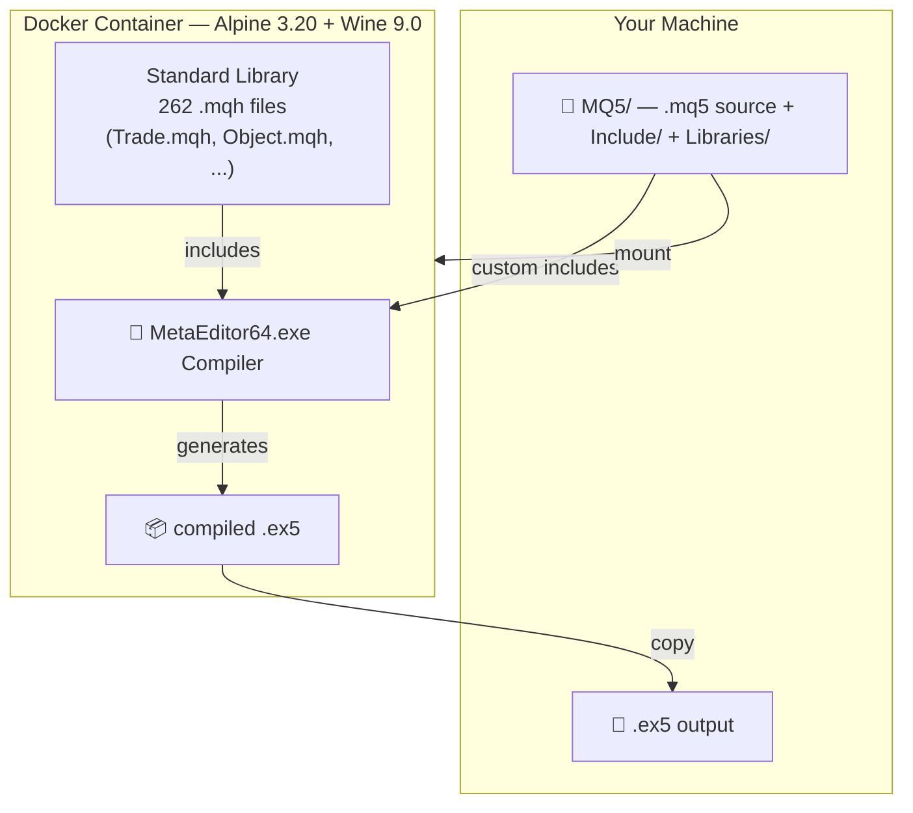

<p align="center">
  
</p>

<h1 align="center">YEBICHU MetaTrader5 Compiler</h1>

<p align="center">
  <strong>☕ MQL5 compilation in a can.</strong> Docker + Wine + MetaEditor64.
  No Windows VM. No GUI. 🚫 Just <code>make compile</code>. ✅
</p>

<p align="center">
  
</p>

---

## What is this?

MetaTrader 5's compiler (`MetaEditor64.exe`) is a Windows binary. It doesn't
run on Linux natively — it doesn't even *like* Linux. This project wraps it
in an Alpine Docker image with Wine 🍷, so you can compile `.mq5` → `.ex5`
from any machine that has Docker. 🐳

No Windows license 💸. No VNC 🖥️. No clicking around 🖱️. One command. ⚡

---

<p align="center">
  
  <br>
  <em>MetaEditor is Windows-native. We just taught it to live in a container.</em>
</p>

## How it works



1. **Build once** — `docker build` downloads MT5 installer, runs `terminal64`
   once to generate the 262-file MQL5 Standard Library, then strips the
   terminal binary saving ~80 MB.
2. **Init once** — `make init` clones the
   [yebichu-mql-metatrader5](https://github.com/mihailnica10/yebichu-mql-metatrader5)
   template into `MQ5/` with a ready-to-compile `MyEA.mq5`.
3. **Compile anytime** — `make compile` mounts `MQ5/` into the container,
   runs MetaEditor headlessly via Xvfb, and hands you back a `.ex5`.

---

<p align="center">
  
  <br>
  <em>Ship once, compile anywhere Docker runs.</em>
</p>

## Features

| What | How |
|---|---|
| **Any platform** | Linux, macOS, Windows — wherever Docker runs |
| **CI/CD ready** | Zero GUI dependency. Xvfb virtual display. |
| **Fast iteration** | Image builds once (~3 min). Compiles take seconds. |
| **Self-contained** | Alpine + Wine + MetaEditor + 262 stdlib headers in one image |
| **Preserves paths** | `.ex5` output mirrors source tree structure |
| **Library support** | `MQ5/Libraries/` dir upserted before compile for `#import` deps |
| **UTF-16 logs** | Compiler output decoded and displayed as readable text |
| **Error reporting** | Full compiler log shown on failure — no mystery exits |
| **Project template** | `make init` creates a clean EA + include scaffold |

## Limitations

<p align="center">
  
  <br>
  <em>This is a compiler, not a terminal. No runtime, no backtester.</em>
</p>

| Limitation | Why |
|---|---|
| **Compilation only** | No `terminal64.exe` — stripped after header init. No backtester, no chart, no trading. |
| **Wine overhead** | Windows binary under Wine ≈ 95% of native speed. Acceptable for compile-only. |
| **Image size** | ~2 GB (Alpine + Wine + MT5). Big but one-time download. |
| **Internet required** | First build downloads the MT5 web installer (~3 MB stub, downloads ~200 MB). |

---

## Directory Structure

```
mql5/
├── Development/        Docker build + scripts (this is the compiler)
│   ├── Dockerfile      Alpine + Wine + MetaEditor image
│   ├── entrypoint.sh   Container-side compile logic
│   ├── compile.sh      Host-side Docker orchestration
│   ├── template/       Scaffold for `make init`
│   └── README.md
├── MQ5/                MQL5 project (git submodule)
│   ├── Experts/        .mq5 sources → .ex5 output (preserves subdirectories)
│   ├── Include/        Custom .mqh include files
│   └── Libraries/      .dll files (upserted before compile)
├── Makefile            Build orchestration
├── .gitmodules         Submodule registration
└── README.md
```

## Quick Start

```bash
# 1. Build the Docker image (one-time)
make build

# 2. Initialize the MQ5 project template
make init

# 3. Compile your EA
make compile
```

Or without the Makefile:

```bash
# Build the image
docker build -t yebichu-mql5-compiler Development/

# Initialize MQ5 template
git submodule update --init MQ5
mkdir -p MQ5/Experts/MyEA MQ5/Include
cp Development/template/MyEA.mq5 MQ5/Experts/MyEA/
cp Development/template/MyLib.mqh MQ5/Include/

# Compile
Development/compile.sh \
    --include MQ5/Include \
    --libraries MQ5/Libraries \
    --output MQ5/Experts \
    MQ5/Experts/MyEA/MyEA.mq5
```

## Requirements

- **Docker** — that's it. No Go, no Node, no Python, no Wine on the host.
- **Internet** — only for the initial `docker build` (downloads MT5).

---

<p align="center">
  <small>🛒 <a href="https://yebichu.com/en/shop">Wear the label</a> — stickers, tees, mugs for compiler enthusiasts 🧢</small>
  <br><br>
  <small>A YEBICHU project.</small>
  <br>
  <small>Repo: <a href="https://github.com/mihailnica10/yebichu-metatrader5-compiler">mihailnica10/yebichu-metatrader5-compiler</a></small>
</p>
<!-- cached -->
